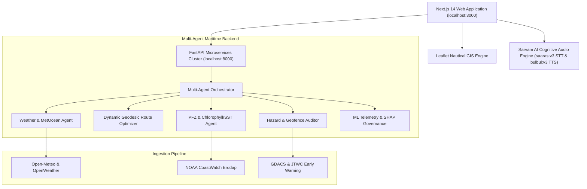

# ORCA (Ocean Risk & Coastal Analytics) — Platform Features Documentation

## Executive Overview
**ORCA** is an intelligent, multi-agent maritime decision-support system designed to empower coastal fishing communities, commercial vessel skippers, marine scientists, and maritime port authorities. 

By unifying real-time oceanographic satellite feeds (NOAA CoastWatch, Open-Meteo, OpenWeather, INCOIS), hydrodynamic physics models, automated geofence auditing, and vernacular voice AI powered by **Sarvam AI**, ORCA bridges the gap between high-level scientific data and practical, life-saving navigational guidance.

---

## System Architecture

---

## Detailed Platform Features Index (18 Modules)

### 1. Executive Landing Hub & Platform Entry
- **Route Path**: `/`
- **Component**: `LandingPage.jsx`
- **Target Audience**: All users, skippers, ocean researchers, port authorities.
- **Key Capabilities**:
  - **Dynamic Multi-Palette Theming**: Real-time switching between 6 high-contrast nautical themes: *Ocean Blue*, *Midnight Dark*, *High-Contrast Radar*, *Slate Grey*, *Sunset Amber*, and *Emerald Green*.
  - **Vernacular Language Selector**: Instant global language selection across 6 coastal Indian languages.
  - **Interactive Leaflet Mini-Map Preview**: Visual introduction to Kerala coastline marine contours and light beacons.
  - **Role-Based Fast Sign-In**: Quick-access portals configured for Marine Scientists, Vessel Skippers, and Port Authorities.

---

### 2. Operations Dashboard & Coastal Command Center
- **Route Path**: `/dashboard`
- **Component**: `DashboardPage.jsx`
- **Target Audience**: Vessel Skippers & Port Operations Managers.
- **Key Capabilities**:
  - **Live Telemetry KPI Cards**: Real-time fleet overview showing *Active Vessels*, *Weather Severity Index*, *High-Risk PFZ Zones*, and *System Latency/Uptime*.
  - **Dynamic 5-Day Wave/Wind Trend Curve**: High-precision SVG Bézier curve charting predicted significant wave heights, swell periods, and wind gust velocities.
  - **20-Zone Potential Fishing Radar Table**: Real-time coordinates, distance from port, chlorophyll-a density, and sea surface temperature (SST).
  - **1-Click Route Plotting**: Direct "Plot Route" action that passes latitude/longitude parameters into the Route Planner.
  - **GDACS & JTWC Cyclone Early Warning Tracker**: Proactive storm radar tracking tropical disturbances in the Arabian Sea.
  - **Docked AI Copilot Box**: Inline natural language prompt dock for quick situational queries.

---

### 3. AI Maritime Copilot & Conversational Reasoning
- **Route Path**: `/ai-copilot`
- **Component**: `CopilotPage.jsx`
- **Target Audience**: Skippers seeking navigational guidance & Marine Scientists.
- **Key Capabilities**:
  - **Multi-Agent Conversational Pipeline**: Orchestrates queries across specialized domain agents (`WeatherAgent`, `RouteAgent`, `SafetyAgent`, `FisheryAgent`).
  - **Sarvam AI Speech-to-Text (`saaras:v3`)**: Native audio recording via HTML5 `MediaRecorder` with streaming transcription optimized for Indian regional accents and maritime vernacular.
  - **Sarvam AI Text-to-Speech (`bulbul:v3`)**: Spoken voice broadcasts in natural Indian accents (speaker `kavitha`), enabling hands-free access for skippers at sea.
  - **Resilient Dual-Engine Fallback**: Seamless automatic fallback to browser native Web Speech API (`webkitSpeechRecognition` & `window.speechSynthesis`) during offline or low-bandwidth states.
  - **Data Provenance & Citation Drawer**: Transparent audit trail showing exact data sources (SST grids, wind vectors, bathymetric depths) used to formulate every answer.

---

### 4. Dynamic Route Planner & Voyage Optimization
- **Route Path**: `/routes`
- **Component**: `RoutePlannerPage.jsx`
- **Target Audience**: Vessel Skippers, Navigators, Port Authorities.
- **Key Capabilities**:
  - **Origin Harbour Registry**: Select departure ports including *Kochi Harbour*, *Munambam Fishing Port*, *Alappuzha Port*, *Chellanam Harbour*, and *Kollam Port*.
  - **Destination Registry & Target Injection**: Choose from PFZ zones, safe refuges, or receive injected custom coordinates from the Fishing or Dashboard pages (`destLat`, `destLon`, `destName`).
  - **3 Dynamic Route Alternatives Engine**:
    - **Route B (Recommended Northwest Fairway)**: Channel-clearing fairway waypoints avoiding nearshore shoals and shallow sandbars.
    - **Route A (Direct Rhumb Line)**: Mathematically shortest direct bearing between origin and destination.
    - **Route C (Southern Offshore Detour)**: Deep-water safety track designed for heavy weather evasion.
  - **Real-Time Geodesic Math**:
    - Total distance dynamically calculated in Nautical Miles (NM) and Kilometers (KM).
    - Transit duration calculated based on vessel cruise speed.
    - Fuel consumption modeled across 4 vessel profiles (*Mechanized Trawler*, *Motorized OBM*, *Traditional Canoe*, *Deep-Sea Longliner*).
  - **Interactive Dynamic Marine Map**: Renders dynamic active (cyan/amber) and inactive (dashed) polylines, green departure anchor, cyan arrival target, and auto-fits the map viewport (`fitBounds`).
  - **Waypoint Sequence Table**: Full leg-by-leg navigation table displaying leg distances, magnetic compass bearings, and ETA timestamps.
  - **Live Backend Route Analysis**: "Recalculate Optimal Track" queries the FastAPI backend (`POST /api/v1/route/analyze`) for live hazard intersections and environmental risk scores.
  - **Vessel GPS Export (`.gpx`)**: "Export to Vessel GPS" generates and downloads standard marine XML `.gpx` files for onboard chartplotters (Garmin, Furuno, Navionics).

---

### 5. Potential Fishing Zone (PFZ) Intelligence
- **Route Path**: `/fishing`
- **Component**: `FishingIntelligencePage.jsx`
- **Target Audience**: Fishermen, Trawler Skippers, Marine Biologists.
- **Key Capabilities**:
  - **Satellite Oceanography Grids**: Ingestion of NOAA CoastWatch Chlorophyll-a concentration ($mg/m^3$) and Sea Surface Temperature (SST) thermal fronts ($^\circ C$).
  - **Home Port Filtering**: Distance-based filtering relative to home harbours (Kochi, Kollam, Munambam, Beypore, Vizhinjam).
  - **3 Operational Sub-Views**:
    1. *PFZ Radar*: Active zones with targeted pelagic fish probability (Sardine, Mackerel, Tuna).
    2. *Productivity Heatmap*: Plankton bloom density and thermal gradient maps.
    3. *Seasonal Catch Trends*: Historical catch-per-unit-effort trends indexed to lunar cycles.
  - **"Route to Zone" Linking**: 1-click button passing selected fishing coordinates directly to the Route Planner.

---

### 6. Maritime Safety & Risk Command Center
- **Route Path**: `/safety`
- **Component**: `SafetyCenterPage.jsx`
- **Target Audience**: Skippers planning departures, Coast Guard, Port Authorities.
- **Key Capabilities**:
  - **4-Tile Risk Evaluation Matrix**: Real-time gauge bars assessing:
    1. *Wave Risk*: Significant wave height and steepness ratio.
    2. *Wind Hazard*: Sustained velocity and gale gust force.
    3. *Depth Clearance*: Bathymetric safety margin relative to vessel draft.
    4. *Geofence Compliance*: Naval firing zones and boundary restrictions.
  - **Interactive Sea Hazard Map**: Geospatial overlay of submerged reefs, shipwrecks, shallow sandbars, and shipping lanes.
  - **Official Warning Bulletins**: Live feed of IMD/INCOIS cyclone advisories, high swell warnings, and squall bulletins.
  - **Geofence & Boundary Security Inspector**: Live tracking of Marine Protected Areas (MPAs), Exclusive Economic Zone (EEZ) limits, and International Maritime Boundary Line (IMBL) buffer zones to prevent accidental cross-border fishing.

---

### 7. Marine Map Explorer (Full GIS Cartography)
- **Route Path**: `/marine-map`
- **Component**: `MarineExplorerPage.jsx`
- **Target Audience**: Marine Navigators, Oceanographers, GIS Specialists.
- **Key Capabilities**:
  - **High-Performance Leaflet Chart**: Maritime navigation chart with OpenSeaMap seamarks, lighthouses, buoys, and depth soundings.
  - **Click-to-Fix Depth Soundings**: Click anywhere on the water to view exact latitude/longitude and bathymetric depth in meters.
  - **16-Layer Geospatial Drawer**: Toggleable layers including Bathymetry, SST, Chlorophyll-a, AIS Vessel Traffic, Surface Ocean Currents, Wind Vectors, and Wave Heights.
  - **48-Hour Forecast Timeline**: Scrub slider (`NOW`, `+6h`, `+12h`, `+24h`, `+48h`) to preview upcoming sea state shifts.
  - **GeoJSON Export**: Instant download of active vector layers for external GIS software (QGIS, ArcGIS).

---

### 8. Multilingual & Vernacular Accessibility Center
- **Route Path**: `/multilingual`
- **Component**: `MultilingualPage.jsx`
- **Target Audience**: Coastal fishermen across diverse linguistic regions.
- **Key Capabilities**:
  - **6 Indic Coastal Languages**: Full support for Malayalam (മലയാളം), Tamil (தமிழ்), Telugu (తెలుగు), Hindi (हिन्दी), Urdu (اردو), and English.
  - **Bidirectional Vernacular Translation**: Translates technical meteorological warnings into simplified vernacular dialects.
  - **Sarvam AI Voice Synthesis (`bulbul:v3`)**: Native audio broadcast with regional voice modulation.
  - **Interactive Audio Controls**: Animated frequency visualizer, adjustable playback speed (0.75x, 1.0x, 1.25x), and instant replay.

---

### 9. Hydrodynamic Scenario Lab & Physics Simulator
- **Route Path**: `/scenarios`
- **Component**: `ScenarioLabPage.jsx`
- **Target Audience**: Naval Architects, Maritime Safety Officers, Trainee Skippers.
- **Key Capabilities**:
  - **Interactive Vessel & Sea State Sliders**: Modify Wave Height ($0-12m$), Wave Period ($2-20s$), Wind Speed ($0-70kt$), Vessel Draft ($1-6m$), and Hull Length ($8-45m$).
  - **Real-Time Physics Engine Calculations**:
    - **Wave Steepness Ratio**: $S = H / \lambda = 2\pi H / (g T^2)$ (Critical breaking threshold at $1/7 \approx 0.142$).
    - **Douglas Sea Scale**: Standardized sea state classification (Calm to Phenomenal).
    - **Beaufort Wind Scale**: Wind force index (Force 0 to Force 12).
    - **Dynamic Capsize Probability**: Vessel beam-to-wave resonance calculation.
    - **IMO S-52 Composite Risk Score**: Combined safety index.
  - **1-Click Emergency Presets**: Immediate test scenarios: *Monsoon Gale*, *Coastal Squall*, *Calm Fairway*, and *Tidal Shoal Race*.

---

### 10. Fleet Alerts & Emergency VHF Broadcast
- **Route Path**: `/alerts`
- **Component**: `AlertsCenterPage.jsx`
- **Target Audience**: Port Command Centers, Coast Guard Dispatch, Fleet Managers.
- **Key Capabilities**:
  - **Tiered Alert Stream**: Real-time notices categorized by severity: *CRITICAL (Red)*, *WARNING (Amber)*, *ADVISORY (Blue)*, *INFO (Slate)*.
  - **Alert Management**: Filter by category, mark items as read/unread, or use "Mark All Read" bulk dismissal.
  - **Simulated VHF Mayday Broadcast**: Interactive emergency modal simulating international **VHF Channel 16 / DSC distress broadcast** transmission with automated GPS coordinates for Search and Rescue (SAR) dispatch.

---

### 11. Regulatory Knowledge & Statutory Gazette
- **Route Path**: `/knowledge`
- **Component**: `KnowledgeCenterPage.jsx`
- **Target Audience**: Fishermen Associations, Marine Enforcement, Policy Researchers.
- **Key Capabilities**:
  - **Searchable Statutory Repository**: Fast search across maritime legal acts, seasonal bans, and safety mandates.
  - **Official Gazette Viewer**: Dedicated modal displaying official statutory clauses, penalties, exemptions, and printable notices.
  - **Policy Categories**:
    - *Monsoon Trawling Ban Regulations*: Seasonal restrictions and artisanal vessel exemptions.
    - *Safety Equipment Mandates*: Life jacket, AIS transponder, and distress flare compliance.
    - *Maritime Boundary Laws*: Territorial waters (12 NM) vs. Contiguous Zone vs. EEZ (200 NM).
    - *Subsidies & Welfare Schemes*: Kerosene/diesel quotas and welfare funds.
  - **"Ask AI About this Policy"**: Injects statutory clauses directly into the AI Copilot for conversational legal advice.

---

### 12. Oceanographic Analytics & Fleet Trends
- **Route Path**: `/analytics`
- **Component**: `AnalyticsPage.jsx`
- **Target Audience**: Marine Biologists, Fisheries Analysts, Fleet Economists.
- **Key Capabilities**:
  - **Domain Sub-Tabs**: Switch between *Marine Physics*, *Fisheries Catch*, *Weather Trends*, and *Risk Index*.
  - **Dynamic Time-Series Visualizations**: Responsive line and bar charts tracking wave energy, SST anomalies, and catch distributions.
  - **Fleet Performance Indicators**: Fuel burn per nautical mile, Catch Per Unit Effort (CPUE), and weather downtime loss metrics.

---

### 13. ML Governance, Model Telemetry & Drift
- **Route Path**: `/ml-governance`
- **Component**: `MLGovernancePage.jsx`
- **Target Audience**: AI/ML Engineers, Data Scientists, Compliance Auditors.
- **Key Capabilities**:
  - **Champion Model Telemetry**: Production tracking for *XGBoost Marine Risk Classifier v2.4* and *LightGBM PFZ Detector v3.1*.
  - **SHAP Explainability Engine**: Feature importance bars breaking down exact prediction weights (SST gradient, wave steepness, wind shear, coastal distance, bathymetry).
  - **3 Governance Sub-Tabs**:
    1. *Model Calibration*: ROC-AUC curves, Brier reliability scores.
    2. *Feature Drift (KS-Test)*: Kolmogorov-Smirnov statistical distribution tests alerting on sensor calibration drift.
    3. *Data Provenance Lineage*: Full tracking from raw satellite telemetry to deployment checkpoints.

---

### 14. System Cluster Health & Ingestion Telemetry
- **Route Path**: `/system-health`
- **Component**: `SystemHealthPage.jsx`
- **Target Audience**: DevOps Engineers, System Administrators.
- **Key Capabilities**:
  - **10 Microservices Cluster Status**: Live heartbeat indicators for: Open-Meteo, NOAA CoastWatch Ingestion, Stormglass Swell Service, OpenWeather Marine, JTWC Cyclone Feed, GDACS Disaster Gateway, Sarvam AI Voice Engine, FastAPI Route Engine, ML Pipeline, and Local Cache.
  - **Cluster Telemetry**: Real-time p95 response latency, pipeline throughput (records/min), and overall service uptime.
  - **"Ping Gateway" Diagnostics**: 1-click active socket and HTTP diagnostic test.

---

### 15. Multi-Agent Workflow & DAG Pipeline Inspector
- **Route Path**: `/workflow`
- **Component**: `WorkflowPage.jsx`
- **Target Audience**: System Architects, Evaluators, SIH/Jury Reviewers.
- **Key Capabilities**:
  - **10-Stage Interactive DAG Stepper**:
    1. *User Query* $\rightarrow$ 2. *Orchestrator* $\rightarrow$ 3. *Specialized Agents* $\rightarrow$ 4. *MCP Connectors* $\rightarrow$ 5. *Data Sources* $\rightarrow$ 6. *Hydrodynamic Risk Engine* $\rightarrow$ 7. *Safety Verifier* $\rightarrow$ 8. *Provenance Tracker* $\rightarrow$ 9. *Response Synthesizer* $\rightarrow$ 10. *UI Presentation*.
  - **Payload Inspection**: Step through with Prev/Next controls to inspect raw JSON payloads, agent reasoning traces, and response schemas.

---

### 16. Responsive Mobile Simulator (Skipper Experience)
- **Route Path**: `/mobile`
- **Component**: `MobileViewPage.jsx`
- **Target Audience**: Demonstrating the responsive smartphone experience for skippers at sea.
- **Key Capabilities**:
  - **Triple-Phone High-Fidelity Mockups**:
    - **Phone 1 — Mobile Operations & Map**: Compact navigation chart with functional bottom navigation bar (Home, Map, PFZ, Alerts, Settings).
    - **Phone 2 — Vernacular Voice Assistant**: Hands-free voice query interface with tap-to-speak chips in Malayalam and Hindi powered by Sarvam AI.
    - **Phone 3 — Coast Guard SOS Mayday**: Emergency 1-tap distress screen displaying live GPS coordinates, VHF Channel 16 frequency guide, and direct Indian Coast Guard hotline (`1554`) dialer.

---

### 17. Profile & Navigational Preferences
- **Route Path**: `/settings`
- **Component**: `ProfileSettingsPage.jsx`
- **Target Audience**: Individual skippers and researchers customizing their account.
- **Key Capabilities**:
  - **User Role Assignment**: Scientist, Skipper, or Port Authority.
  - **Vessel Fleet Configuration**: Configure vessel length, draft, engine horsepower, cruising speed, and fuel consumption rate for personalized route calculations.
  - **Safety Threshold Controls**: Set custom risk cutoffs for maximum permissible wave height, wind gust warnings, and night navigation advisories.

---

### 18. Role-Based Authentication & Demonstration Access
- **Route Path**: `/login`
- **Component**: `LoginPage.jsx`
- **Target Audience**: Evaluators and team members testing different permission levels.
- **Key Capabilities**:
  - **1-Click Persona Login**: Automatically fills credentials and redirects to role-optimized views:
    - *Marine Scientist*: Opens oceanographic analytics and ML governance.
    - *Vessel Skipper*: Opens route planner, weather safety alerts, and vernacular copilot.
    - *Port Authority*: Opens fleet safety radar, geofence surveillance, and VHF broadcast.

---

## Technical Specifications Summary

| Layer | Technologies & Services |
| :--- | :--- |
| **Frontend Framework** | Next.js 14, React 18, TailwindCSS |
| **GIS & Cartography** | Leaflet.js, OpenSeaMap, OpenStreetMap, GeoJSON |
| **Vernacular Voice AI** | **Sarvam AI** (`saaras:v3` STT, `bulbul:v3` TTS), Web Speech API Fallback |
| **Backend Framework** | FastAPI (Python 3.11+), Uvicorn, Pydantic v2 |
| **Data Sources** | NOAA CoastWatch (ERDDAP), Open-Meteo, OpenWeatherMap, GDACS, JTWC |
| **ML & Analytics** | XGBoost, LightGBM, SHAP, NumPy, SciPy |
| **Navigation Format** | GPS Exchange Format (`.gpx` XML) |

---

*Generated by ORCA Documentation Engine — 2026*
